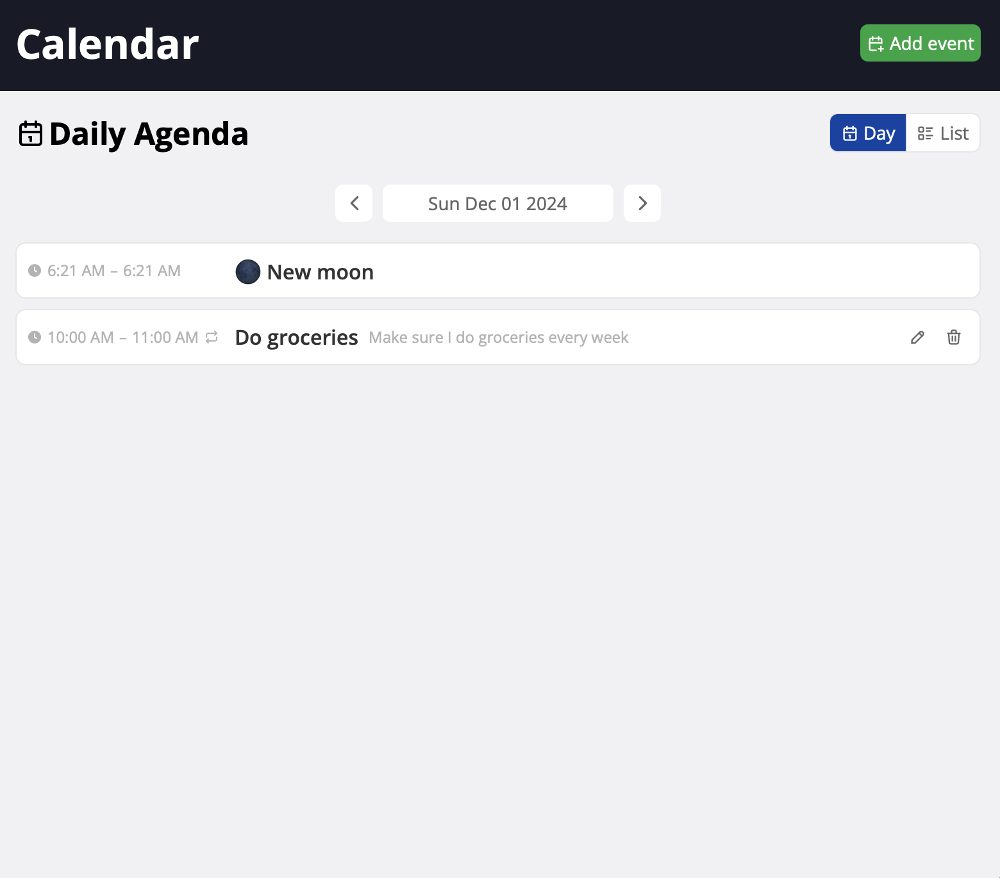
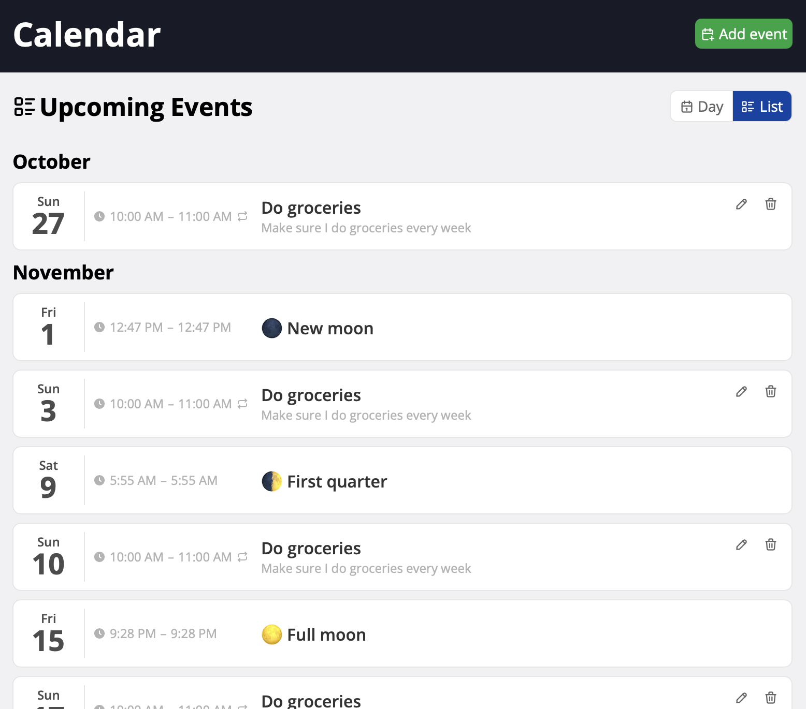

# Calendar Exercise

## Start

Install dependencies

``` sh
$ pnpm install
```

Start the dev server

``` sh
$ pnpm run dev
```

And start the JSON DB server

``` sh
$ pnpm run server
```

Run the tests

``` sh
$ pnpm run test
```

## Requirements

### Phase One: Basic Calendar Functionality

In this initial phase, the goal is to establish the basic functionality of the calendar app. This involves creating several key components:

 1. **Date Picker**: This can be a native html date input, allowing users to select a date.
 2. **Event Form**: Here, users can create calendar events. Each event will include a title, description, start date/time, and end date/time.
 3. **Event List**: This component displays all calendar events for a given day. Each event will be listed along with its details, such as title,
description, start and end times. There should also be buttons to edit or delete an event.

### Phase Two: Integrating Third-Party Calendar Events

In this next phase, the focus is on expanding the app's capabilities by integrating with a third-party API to fetch additional calendar events.
Here's what needs to be done:

 1. **Integration with Moon API**: Implement functionality to fetch calendar events from the Moon API. This API provides data on moon
phases for specific dates.
    - Moon API GitHub — [CraigChamberlain/moon-data: static json api](https://github.com/CraigChamberlain/moon-data)
      - e.g. https://craigchamberlain.github.io/moon-data/api/moon-phase-data/2023/
 2. **Display Third-Party Events**: Update the event list component to incorporate fetched events from the Moon API. These events will be
displayed alongside user-created events, providing users with a comprehensive view of their schedule.

### Phase Three: Implementing Recurring Events

Let’s introduce the ability for calendar events to be recurring. Recurring events can occur on a weekly, monthly, or annual basis.

 1. **Recurring Event Functionality**: Enhance the event form to allow users to specify whether an event is recurring and the recurrence
pattern (weekly, monthly, annually).
 2. **Display Recurring Events**: Modify the event list component to display recurring events
## Screenshots

### Day View



### List View


